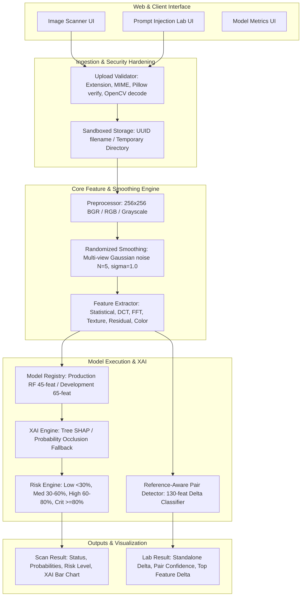

# VISIONGUARD
### Input-Level Security Scanner for Vision-Language Models

[](https://www.python.org/downloads/)
[](https://flask.palletsprojects.com/)
[](https://scikit-learn.org/)
[](https://shap.readthedocs.io/)
[](#scientific-limitations--non-claims)

---

## Table of Contents

- [1. Project Overview](#1-project-overview)
- [2. Problem Statement & Threat Model](#2-problem-statement--threat-model)
- [3. Project Objectives](#3-project-objectives)
- [4. Key Features](#4-key-features)
- [5. High-Level Architecture & System Design](#5-high-level-architecture--system-design)
- [6. Detailed Data Flow & Request Lifecycle](#6-detailed-data-flow--request-lifecycle)
- [7. Prompt Injection Lab & Pair Detection](#7-prompt-injection-lab--pair-detection)
- [8. Multi-Domain Feature Extraction Pipeline](#8-multi-domain-feature-extraction-pipeline)
  - [Statistical Domain (9 Features)](#statistical-domain-9-features)
  - [Discrete Cosine Transform Domain (5 Features)](#discrete-cosine-transform-domain-5-features)
  - [Fast Fourier Transform / Spectral Domain (7 Features)](#fast-fourier-transform--spectral-domain-7-features)
  - [Texture Domain (20 Features: LBP + GLCM)](#texture-domain-20-features-lbp--glcm)
  - [Perturbation-Sensitive Residual & Color Domain (20 Features)](#perturbation-sensitive-residual--color-domain-20-features)
  - [High-Pass Baseline Residual Domain (4 Features)](#high-pass-baseline-residual-domain-4-features)
  - [Feature Fusion & Canonical Alignment](#feature-fusion--canonical-alignment)
- [9. Preprocessing & Randomized Smoothing](#9-preprocessing--randomized-smoothing)
- [10. Controlled Perturbation Simulator](#10-controlled-perturbation-simulator)
- [11. Dataset Architecture & Split Strategy](#11-dataset-architecture--split-strategy)
- [12. Dataset Generation & Training Workflow](#12-dataset-generation--training-workflow)
- [13. Model Zoo & Performance Benchmarks](#13-model-zoo--performance-benchmarks)
  - [Production Model (45 Features)](#production-model-45-features)
  - [Development Candidates (65 Features)](#development-candidates-65-features)
  - [Reference-Aware Pair Detector (130 Features)](#reference-aware-pair-detector-130-features)
- [14. Technologies, Frameworks & Libraries](#14-technologies-frameworks--libraries)
- [15. Installation & Local Setup](#15-installation--local-setup)
- [16. Web Application & Route Reference](#16-web-application--route-reference)
- [17. Configuration Reference](#17-configuration-reference)
- [18. Repository Directory Structure](#18-repository-directory-structure)
- [19. Security Architecture & Upload Hardening](#19-security-architecture--upload-hardening)
- [20. Scientific Limitations & Non-Claims](#20-scientific-limitations--non-claims)
- [21. Testing & Verification Suite](#21-testing--verification-suite)
- [22. License](#22-license)

---

## 1. Project Overview

**VisionGuard** is an input-level security scanner and defensive research platform designed to detect controlled, adversarial-like image perturbations before visual inputs are forwarded to downstream vision-language models (VLMs) or multimodal AI pipelines.

Modern vision-language systems ingest raw images alongside text prompts. High-capacity neural networks can be sensitive to subtle, structured, or frequency-domain pixel manipulations that are nearly imperceptible to human operators. VisionGuard acts as a lightweight pre-ingestion security barrier: it analyzes the spatial, spectral, statistical, texture, and residual characteristics of incoming images using classical machine-learning ensembles and interpretable feature extraction.

```
Incoming Image ──▶ [ VisionGuard Input Filter ] ──▶ Clean / Low Risk ──▶ Downstream VLM / API
                                 │
                                 └──▶ Suspicious / High Risk ──▶ Quarantine & Alert
```

### What VisionGuard Analyzes
- **Low-level statistical anomalies**: Disruption in image intensity histograms, higher-order moments (skewness, kurtosis), and Shannon entropy.
- **Spectral and frequency concentrations**: Energy anomalies across low, mid, and high radial frequency bands in Discrete Cosine Transform (DCT) and Fast Fourier Transform (FFT) spectra.
- **Micro-texture irregularities**: Local Binary Pattern (LBP) uniform distributions and Gray-Level Co-occurrence Matrix (GLCM) spatial second-order statistics.
- **Multi-scale and chromatic residuals**: High-pass filtering residuals across multiple Gaussian kernel scales ($\sigma \in \{0.5, 1.0, 2.0\}$), directional Sobel gradient anisotropy, and inter-channel chromatic discrepancies ($R-G, R-B, G-B$).

### What the Output Represents
VisionGuard produces a definitive binary status (`VERIFIED/CLEAN` vs. `SUSPICIOUS`) evaluated against a validation-tuned probability threshold, alongside a four-tier risk band (`LOW`, `MEDIUM`, `HIGH`, `CRITICAL`) and local feature attributions generated via Tree SHAP or probability-occlusion sensitivity.

> **Distinction Between Implemented Functionality and Research Scope:**
> VisionGuard detects statistical, spectral, texture, and residual anomalies associated with the *controlled perturbation families represented in training and evaluation*. It is an empirical defensive filter and research sandbox; it does **not** claim universal detection of arbitrary real-world zero-day multimodal jailbreaks or unconstrained physical attacks.

---

## 2. Problem Statement & Threat Model

### The Problem
Vision-Language Models (such as GPT-4V, LLaVA, Claude 3.5 Sonnet, and Gemini) process vision inputs through vision transformer (ViT) or convolutional backbones. These backbones are vulnerable to adversarial perturbations—carefully crafted mathematical patterns added to pixel values that cause downstream models to misclassify, hallucinate, ignore safety guardrails, or execute indirect visual prompt injections.

### Why Image-Level Pre-Filtering?
1. **Computational Efficiency**: Running full-scale transformer inference on malicious or corrupted inputs wastes high-cost GPU compute.
2. **Model-Agnostic Defense**: Classical statistical and spectral feature extractors operate independently of specific VLM architectures or weights.
3. **Auditability & Explainability**: Decision tree ensembles and SHAP values provide deterministic, inspectable evidence of manipulation without relying on a black-box neural discriminator.

### Threat Model
VisionGuard models the following input threat space:
- **Perturbation Magnitude ($\epsilon$)**: Weak to moderate bounded perturbations in the range of $\epsilon \in [0.5, 5.0]$ pixel intensity values ($L_\infty$ and $L_2$ bounded).
- **Perturbation Families**:
  - Additive Gaussian noise ($\mu=0, \sigma=\epsilon$, clipped to $\pm 2\epsilon$).
  - High-frequency sinusoidal wave interference (variable angle, phase, and frequency).
  - Spatial block checkerboard artifacts.
  - Sparse 2D Discrete Cosine Transform (DCT) basis spikes.
  - Sparse 2D Fast Fourier Transform (FFT) conjugate frequency spikes.
  - Synthetic prompt-conditioned spectral perturbations (SHA-256 seeded harmonic patterns).

---

## 3. Project Objectives

1. **Deterministic Multi-Domain Feature Extraction**: Extract a comprehensive set of 65 numerical features spanning spatial, frequency, texture, gradient, and chromatic domains without data leakage.
2. **Defensive Model Evaluation**: Train, optimize, and evaluate five diverse classifier families (RandomForest, XGBoost, LightGBM, CatBoost, Support Vector Machines) using group-aware dataset partitioning.
3. **Validation-Driven Threshold Calibration**: Calibrate classification thresholds on held-out validation splits to balance precision, recall, and false-positive rates on clean images.
4. **Transparent Explainability (XAI)**: Provide local feature attribution using Tree SHAP (with probability-occlusion fallback) for every inference call.
5. **Prompt Injection Simulation & Pair Analysis**: Provide an interactive research laboratory to synthesize bounded, deterministic prompt-conditioned perturbations and evaluate both standalone classifiers and a dedicated 130-feature reference-aware pair detector.
6. **Hardened Web Service**: Deliver a production-grade Flask web application featuring strict upload validation, MIME/magic-byte verification, safe filesystem sandboxing, and dynamic UI dashboards.

---

## 4. Key Features

- **Multi-Domain Feature Engine**: 65 distinct features extracted across 6 scientific domains (Statistical, DCT, FFT/Spectral, Texture, Perturbation-Sensitive Residuals, High-Pass Residuals).
- **Selectable Model Registry**: Seamless switching between the approved 45-feature production RandomForest model and five 65-feature development candidates (RandomForest, XGBoost, LightGBM, CatBoost, SVM).
- **Reference-Aware Pair Detector**: A specialized 130-feature classifier trained on signed and absolute feature deltas between original and modified image pairs.
- **Explainable AI (XAI)**: Real-time Tree SHAP feature contribution ranking with automated horizontal bar plot generation and scientific domain tagging.
- **Weak Randomized Smoothing**: Optional multi-view Gaussian smoothing ($\sigma=1.0$, $N=5$ views) with $\pm 3\sigma$ clipping to average out localized noise artifacts during extraction.
- **Interactive Prompt Injection Lab**: Deterministic synthesis of prompt-conditioned image perturbations with instant visual comparison (Original vs. Modified vs. 16× Amplified Difference).
- **Hardened Upload Validation**: Strict multi-tier validation checking file extension, Pillow binary decode, format canonicalization, and OpenCV full pixel decompression.
- **Live Metrics Dashboard**: Server-rendered benchmark tables, ROC curves, PR curves, F1 comparisons, and feature ablation visualizations.

---

## 5. High-Level Architecture & System Design

VisionGuard consists of two primary operational paths:
1. **The Standalone Scanner Path**: Accepts a single unknown image, extracts multi-domain features, and applies the selected classifier and threshold.
2. **The Prompt Injection Lab Path**: Accepts an original image and a text prompt, generates a bounded prompt-conditioned perturbation, and executes both standalone scanning and reference-aware differential pair classification.



---

## 6. Detailed Data Flow & Request Lifecycle

When a user submits an image via the web scanner (`POST /scan`):

```
1. File Upload (Multipart POST)
   │
2. Byte Limit Check (MAX_CONTENT_LENGTH = 16 MB)
   │
3. Extension Verification (Allowed: .jpg, .jpeg, .png)
   │
4. Binary Header & Format Probing (PIL verify() -> JPEG or PNG)
   │
5. Full Pixel Decoding (OpenCV cv2.imdecode -> uint8 BGR matrix)
   │
6. Safe Storage (Saved under uuid4().hex in temporary folder)
   │
7. Canonical Preprocessing (Resized to 256x256 via INTER_AREA/INTER_LINEAR)
   │
8. Multi-View Smoothing (If enabled: generate N views with Gaussian noise)
   │
9. Multi-Domain Feature Extraction (Compute all 45 or 65 numerical features)
   │
10. Feature Vector Alignment (Ordered strictly matching model's feature_columns.pkl)
   │
11. Model Inference (predict_proba() -> Class 0: Clean, Class 1: Attack)
   │
12. Decision Calibration (attack_probability >= model.threshold -> SUSPICIOUS)
   │
13. Risk Level Mapping (LOW: <30%, MEDIUM: 30-59.9%, HIGH: 60-79.9%, CRITICAL: >=80%)
   │
14. Local XAI Attribution (Tree SHAP computes contributions for top 5 features)
   │
15. Response Packaging (Rendered result.html with embedded base64 image and plot)
```

---

## 7. Prompt Injection Lab & Pair Detection

The Prompt Injection Lab (`/prompt-lab`) allows researchers to simulate prompt-conditioned image manipulations and measure detector sensitivity.

### Deterministic Prompt Perturbation Algorithm
1. **Seed Derivation**: The input prompt text is hashed using SHA-256. The first 8 bytes of the digest are converted to a 64-bit integer seed:
   $$\text{Seed} = \text{int}(\text{SHA256}(\text{prompt})[0:8])$$
2. **Harmonic & Spectral Synthesis**:
   - A 2D spatial sinusoid is generated with prompt-seeded frequency ($f \in [8, 25]$), orientation angle ($\theta \in [0, \pi]$), and phase ($\phi \in [0, 2\pi]$):
     $$S(x, y) = \sin\left(\frac{2\pi f (x\cos\theta + y\sin\theta)}{\max(H, W)} + \phi\right)$$
   - A 2D separable cosine basis pattern ($D(x, y)$) is synthesized using prompt-seeded vertical and horizontal frequencies.
   - Structured Gaussian noise ($N(x, y) \sim \mathcal{N}(0, 0.18^2)$) is blended in:
     $$P_{\text{spatial}} = 0.62 \cdot S(x, y) + 0.30 \cdot D(x, y) + 0.08 \cdot N(x, y)$$
3. **RGB Channel Weighting & Scaling**:
   - Independent channel weights ($w_c \in [0.65, 1.0]$) and random signs ($s_c \in \{-1, +1\}$) are applied per color channel.
   - The perturbation is scaled by the selected perturbation strength ($\epsilon$):
     $$I_{\text{modified}} = \text{clip}\left(I_{\text{original}} + \epsilon \cdot \frac{P}{\max|P|}, 0, 255\right)$$

### Available Perturbation Strengths
| Strength Level | Epsilon ($\epsilon$) Value | Maximum Per-Channel Pixel Shift |
| :--- | :--- | :--- |
| **Very Low** | $0.5$ | $\pm 0.5$ intensity levels |
| **Low** *(Default)* | $1.0$ | $\pm 1.0$ intensity levels |
| **Medium** | $2.0$ | $\pm 2.0$ intensity levels |
| **High** | $4.0$ | $\pm 4.0$ intensity levels |

### The Reference-Aware Pair Detector (`RandomForestPairDetector`)
In addition to running standalone model inference on both images, the lab executes a dedicated reference-aware pair detector:
- **Inputs**: 130 features consisting of:
  - 65 Signed deltas: $\Delta_{\text{signed}} = f_{\text{modified}} - f_{\text{original}}$
  - 65 Absolute deltas: $\Delta_{\text{abs}} = |f_{\text{modified}} - f_{\text{original}}|$
- **Performance**: Achieves **98.5% F1 score** and **82.7% unseen prompt recall** on held-out test pairs at a conservative 5.0% decision threshold.
- **Output**: Determines whether a statistically significant controlled modification occurred between reference and candidate images.

---

## 8. Multi-Domain Feature Extraction Pipeline

VisionGuard extracts 65 canonical numerical features across 6 distinct mathematical domains:

```
Canonical Feature Vector (65 Dimensions)
├── Statistical Domain (9 features)
├── Discrete Cosine Transform Domain (5 features)
├── Fast Fourier Transform / Spectral Domain (7 features)
├── Texture Domain (20 features: 10 LBP + 10 GLCM)
├── Perturbation-Sensitive Residual & Color Domain (20 features)
└── Baseline High-Pass Residual Domain (4 features)
```

### Statistical Domain (9 Features)
Computed on normalized 8-bit grayscale pixels ($x_i \in [0, 255]$):
- `stat_mean`: Arithmetic mean intensity ($\mu$).
- `stat_variance`: Second central moment ($\sigma^2$).
- `stat_std`: Standard deviation ($\sigma$).
- `stat_skewness`: Adjusted Fisher-Pearson coefficient of skewness ($g_1$).
- `stat_kurtosis`: Fisher's excess kurtosis ($g_2$, zero for normal distribution).
- `stat_shannon_entropy`: Base-2 Shannon entropy computed on the 256-bin grayscale histogram ($-\sum p_i \log_2 p_i$).
- `stat_median`: 50th percentile pixel intensity.
- `stat_min`: Minimum pixel value.
- `stat_max`: Maximum pixel value.

### Discrete Cosine Transform Domain (5 Features)
Computed via 2D Type-II Discrete Cosine Transform on float32 image normalized to $[0, 1]$:
- Normalized radial distance from DC ($r = \sqrt{y^2 + x^2} / \sqrt{(H-1)^2 + (W-1)^2}$):
  - **Low Frequency**: $r \le 0.15$
  - **Mid Frequency**: $0.15 < r \le 0.50$
  - **High Frequency**: $r > 0.50$
- `dct_total_energy`: Sum of squared DCT coefficients ($\sum C_{u,v}^2$).
- `dct_low_energy`: Sum of squared energy in low-frequency mask.
- `dct_mid_energy`: Sum of squared energy in mid-frequency mask.
- `dct_high_energy`: Sum of squared energy in high-frequency mask.
- `dct_high_ratio`: Ratio of high-frequency energy to total energy ($\frac{\text{High-Frequency Energy}}{\text{Total Energy}}$).

### Fast Fourier Transform / Spectral Domain (7 Features)
Computed via 2D Fast Fourier Transform with zero-frequency DC component shifted to center:
- `fft_magnitude_mean`: Mean magnitude across 2D spectrum ($|F(u,v)|$).
- `fft_magnitude_std`: Standard deviation of Fourier spectral magnitude.
- `fft_magnitude_max`: Peak magnitude (excluding DC component).
- `fft_low_ratio`: Fraction of power spectrum in centered radial radius $r \le 0.15$.
- `fft_mid_ratio`: Fraction of power spectrum in centered radial ring $0.15 < r \le 0.50$.
- `fft_high_ratio`: Fraction of power spectrum in outer radial region $r > 0.50$.
- `spectral_entropy`: Shannon entropy of the normalized spectral power distribution.

### Texture Domain (20 Features: LBP + GLCM)
1. **Uniform Local Binary Patterns (10 Features)**:
   - Evaluated with $P=8$ circularly symmetric neighbors at radius $R=1$.
   - Uniform patterns with $\le 2$ bitwise transitions sorted into 9 bins; all non-uniform patterns grouped into bin 10:
   - `lbp_uniform_bin_00` through `lbp_uniform_bin_09`: Normalized 10-bin histogram.
2. **Gray-Level Co-occurrence Matrix (10 Features)**:
   - Pixels quantized into 16 uniform grayscale levels ($[0, 15]$).
   - GLCM computed at distance $d=1$ across 4 angles ($\theta \in \{0, \frac{\pi}{4}, \frac{\pi}{2}, \frac{3\pi}{4}\}$).
   - Mean and standard deviation across angles extracted for 5 Haralick properties:
     - `glcm_contrast_mean`, `glcm_contrast_std`: Intensity contrast between a pixel and its neighbor.
     - `glcm_dissimilarity_mean`, `glcm_dissimilarity_std`: Absolute difference in pixel pairs.
     - `glcm_homogeneity_mean`, `glcm_homogeneity_std`: Closeness of element distribution to diagonal.
     - `glcm_energy_mean`, `glcm_energy_std`: Uniformity (Angular Second Moment).
     - `glcm_correlation_mean`, `glcm_correlation_std`: Linear dependency of gray levels.

### Perturbation-Sensitive Residual & Color Domain (20 Features)
Designed to capture ultra-weak structured anomalies without requiring a clean reference:
1. **Multi-Scale Gaussian Residuals (9 Features)**:
   - High-pass residuals $R_\sigma = I - \text{GaussianBlur}(I, \sigma)$ at scales $\sigma \in \{0.5, 1.0, 2.0\}$:
   - `msres_sigma_0_5_mean_abs`, `msres_sigma_0_5_std`, `msres_sigma_0_5_energy`
   - `msres_sigma_1_0_mean_abs`, `msres_sigma_1_0_std`, `msres_sigma_1_0_energy`
   - `msres_sigma_2_0_mean_abs`, `msres_sigma_2_0_std`, `msres_sigma_2_0_energy`
2. **Directional Gradient & Anisotropy (4 Features)**:
   - Sobel horizontal ($G_x$), vertical ($G_y$), and diagonal ($G_d = \frac{G_x+G_y}{\sqrt{2}}$) gradients:
   - `directional_gradient_x_energy`: Mean squared $G_x$.
   - `directional_gradient_y_energy`: Mean squared $G_y$.
   - `directional_gradient_diagonal_energy`: Mean squared $G_d$.
   - `directional_gradient_anisotropy`: Directional imbalance ratio $\frac{|E_x - E_y|}{\max(E_x + E_y, 10^{-12})}$.
3. **Spectral Peak & Local Variation (3 Features)**:
   - `spectral_peak_top1_ratio`: Fraction of spectral energy concentrated in top 1% highest-magnitude frequencies.
   - `spectral_peak_high_zscore`: Z-score of the single highest spectral peak relative to spectrum mean/std.
   - `spectral_local_variation`: Coefficient of variation across $16 \times 16$ spatial FFT block means.
4. **Color-Difference Residuals (4 Features)**:
   - High-pass filtering on chromatic differences ($R-G$, $R-B$, $G-B$) to detect chromatic grid noise:
   - `color_residual_rg_std`: Std of Gaussian residual on $(R-G)$.
   - `color_residual_rb_std`: Std of Gaussian residual on $(R-B)$.
   - `color_residual_gb_std`: Std of Gaussian residual on $(G-B)$.
   - `color_residual_chroma_energy`: Combined mean squared energy across all chromatic residuals.

### High-Pass Baseline Residual Domain (4 Features)
Computed using standard $5 \times 5$ Gaussian blur baseline ($\sigma=1.0$):
- `residual_mean_abs`: Mean absolute residual ($|I - I_{\text{blur}}|$).
- `residual_std`: Standard deviation of residual.
- `residual_energy`: Mean squared residual energy.
- `residual_max_abs`: Maximum absolute residual peak.

### Feature Fusion & Canonical Alignment
- Production Model Schema: **45 Features** (Statistical + DCT + FFT + Texture + Baseline Residual).
- Development Model Schema: **65 Features** (All 45 production features + 20 Perturbation-Sensitive features).
- In both pipelines, features are extracted into a dictionary and validated against exact saved column ordering (`feature_columns.pkl` or `candidate_feature_columns.pkl`) before inference.

---

## 9. Preprocessing & Randomized Smoothing

To ensure consistency and prevent machine-learning shortcut learning (such as learning JPEG compression artifacts vs. PNG uncompressed pixels), VisionGuard enforces a strict preprocessing pipeline across training and inference.

```
Raw Image (JPG/PNG) ──▶ OpenCV Decode (BGR uint8)
                               │
                               ▼
            Resize to 256x256 Square Dimensions
       (INTER_AREA if downsampling, INTER_LINEAR if upsampling)
                               │
            ┌──────────────────┴──────────────────┐
            ▼                                     ▼
     RGB Representation                  Grayscale Matrix
(Color Residuals & Display)          (Statistical, DCT, FFT, LBP)
```

### Preprocessing Specifications
- **Input Formats**: JPEG, JPG, PNG (RGB or RGBA; alpha channels automatically converted to standard 3-channel BGR).
- **Target Resolution**: Exactly $256 \times 256$ pixels.
- **Interpolation**: `cv2.INTER_AREA` when resizing from larger dimensions; `cv2.INTER_LINEAR` when resizing from smaller dimensions.
- **Data Types**: Contiguous `uint8` arrays normalized to $[0, 1]$ `float32` / `float64` inside individual extractors.

### Weak Randomized Smoothing
VisionGuard includes an optional randomized smoothing module (`core/smoothing.py`):
- **Purpose**: Creates multiple slightly perturbed views of the input image before feature extraction and averages the resulting feature vectors to stabilize sensitive frequency features.
- **Configuration**:
  - `SMOOTHING_ENABLED`: Boolean (Default: `False`).
  - `SMOOTHING_VIEWS`: Number of stochastic views (Default: `5`).
  - `SMOOTHING_SIGMA`: Standard deviation of Gaussian noise (Default: `1.0`).
  - `noise_clipping`: Bounded strictly to $[-3\sigma, +3\sigma]$ to preserve underlying manipulation structure while smoothing out sensor noise.

---

## 10. Controlled Perturbation Simulator

The standalone perturbation simulator (`training/generate_perturbations.py`) implements five controlled synthetic perturbation families used to create defensive research benchmarks:

```
Clean Base Image ──▶ [ Perturbation Generator ] ──▶ Bounded Perturbed Image (PNG)
                            │
              Parameters: Attack Type, Epsilon, Seed
```

| Attack Type | Mathematical Formulation | Typical Epsilon ($\epsilon$) | Dominant Artifact Signatures |
| :--- | :--- | :--- | :--- |
| **Gaussian** (`gaussian`) | $\delta \sim \mathcal{N}(0, \epsilon^2)$, clipped to $\pm 2\epsilon$ | $1.0 - 5.0$ | Elevated `stat_variance`, `msres_sigma_*_energy`, high-frequency DCT energy |
| **Sinusoidal** (`sinusoidal`) | $\delta(x, y) = \epsilon \sin\left(\frac{2\pi f (x\cos\theta + y\sin\theta)}{D} + \phi\right)$ | $1.0 - 5.0$ | Sharp spectral peaks in `fft_high_ratio`, directional Sobel gradient spikes |
| **Checkerboard** (`checkerboard`) | $\delta(x, y) = \epsilon \left(2\left[\left(\lfloor\frac{x}{b}\rfloor + \lfloor\frac{y}{b}\rfloor\right) \bmod 2\right] - 1\right)$ | $1.0 - 5.0$ | Strong harmonic grid in DCT/FFT, LBP non-uniform distribution shifts |
| **DCT Frequency** (`dct`) | Sparse 2D cosine basis $C_{u,v}(x, y)$ normalized to unit amplitude | $1.0 - 5.0$ | Single-frequency energy spike in `dct_mid_energy` or `dct_high_energy` |
| **FFT Frequency** (`fft`) | Conjugate pair in 2D Fourier spectrum transformed via 2D IFFT | $1.0 - 5.0$ | Concentrated spectral peak in `spectral_peak_top1_ratio`, `spectral_peak_high_zscore` |

All generator routines enforce strict uint8 rounding, boundary clipping $[0, 255]$, and lossless PNG output writing.

---

## 11. Dataset Architecture & Split Strategy

To ensure valid scientific evaluation, VisionGuard enforces a **strict group-aware dataset partitioning strategy** based on the root image identifier (`base_id`).

### The Base Image Leakage Problem
If a clean image and its manipulated derivatives (e.g., `coco_train_0001.png` and `coco_train_0001_gaussian.png`) are randomly split across training and test sets, the model can memorize background image features (edges, color distribution, semantics) rather than learning manipulation artifacts.

```
[ Clean Base Image: base_001 ] ──┬──▶ clean/base_001.png
                                 ├──▶ attacked/base_001_gaussian.png
                                 ├──▶ attacked/base_001_sinusoidal.png
                                 └──▶ attacked/base_001_prompt.png
                                              │
                      MUST ALL REMAIN IN THE SAME SPLIT
                                (e.g., 100% in Train OR 100% in Test)
```

### Group-Aware Splitting (`GroupShuffleSplit`)
VisionGuard uses `GroupShuffleSplit` on `base_id`:
- **Training Split**: 70% of base image groups.
- **Validation Split**: 15% of base image groups (used strictly for threshold calibration).
- **Test Split**: 15% of base image groups (held-out for final metric reporting).

### Dataset Repositories in VisionGuard
1. **Engineering Smoke-Test Dataset** (`data/clean_normalized`, `data/attacked`):
   - 100 Base COCO-2017 images $\rightarrow$ 200 total images (100 clean, 100 attacked).
   - Used to train and benchmark the production 45-feature RandomForest model.
2. **Expanded Development Dataset** (`data/development`):
   - 500 Base COCO-2017 images $\rightarrow$ 3,500 total images (500 clean, 3,000 attacked across 6 attack families).
   - Balanced across 4 strength bands: `very-low` ($\epsilon=0.5$), `low` ($\epsilon=1.0$), `medium` ($\epsilon=2.0$), `high` ($\epsilon=4.0$).
   - Partitioned into 350 train base groups (2,450 samples), 75 validation base groups (525 samples), and 75 test base groups (525 samples).
3. **External Generalization Holdout** (`data/external_holdout`):
   - 100 Unseen clean images acquired from Open Images v7 validation split to test cross-dataset false positive rates.

### Disjoint Prompt Banks
Prompt-conditioned simulations use strictly isolated prompt sets to prevent semantic prompt memorization:
- `TRAIN_PROMPTS`: 8 neutral study prompts.
- `VALIDATION_PROMPTS`: 3 validation-only prompts.
- `TEST_PROMPTS`: 3 unseen holdout evaluation prompts.

---

## 12. Dataset Generation & Training Workflow

Follow this step-by-step command sequence to reproduce or train VisionGuard models from scratch.

### Step 1: Download Clean COCO-2017 Images
Acquires and validates clean base images via FiftyOne:
```bash
python training/download_dataset.py --max-samples 100 --seed 42
```
*Outputs: `data/clean/` and `data/metadata/clean_manifest.csv`.*

### Step 2: Build the Paired Smoke-Test Dataset
Generates paired clean and perturbed images:
```bash
python training/build_dataset.py --epsilon-min 1.0 --epsilon-max 5.0 --seed 42
```
*Outputs: `data/clean_normalized/`, `data/attacked/`, and `data/metadata/dataset_metadata.csv`.*

### Step 3: Extract Multi-Domain Features
Extracts the canonical feature matrix with checkpointing:
```bash
python training/extract_dataset_features.py --resume --checkpoint-every 25
```
*Outputs: `data/features/fused_features.csv`.*

### Step 4: Train Production Baseline Models
Trains five classifiers, tunes validation thresholds, and saves the top performer:
```bash
python training/train_models.py --seed 42
```
*Outputs: `models/best_model.pkl`, `models/feature_columns.pkl`, `models/model_metadata.json`, and `models/model_metrics.csv`.*

### Step 5: Generate Evaluation Plots & Ablations
Computes confusion matrices, ROC curves, PR curves, and feature domain ablations:
```bash
python training/evaluate_models.py
```
*Outputs: `static/generated/*.png` and `static/generated/*.csv`.*

---

### Expanded Development & Research Pipeline

To train the enhanced 65-feature development candidates and reference-aware pair detector:

```bash
# 1. Build the 500-base development dataset (3,500 images)
python training/build_development_dataset.py --seed 42

# 2. Extract 65-feature development matrix
python training/extract_dataset_features.py \
  --metadata data/metadata/development_dataset.csv \
  --output data/features/development_features.csv \
  --resume

# 3. Download external Open Images v7 clean holdout
python training/download_external_holdout.py --max-samples 100

# 4. Train 65-feature candidate models (RF, XGBoost, LightGBM, CatBoost, SVM)
python training/train_development_models.py

# 5. Train the 130-feature reference-aware pair detector
python training/train_pair_detector.py

# 6. Evaluate held-out prompt-conditioned pairs
python training/evaluate_prompt_pairs.py --candidate --split test --epsilon 4.0
```

---

## 13. Model Zoo & Performance Benchmarks

### Production Model (45 Features)
- **Architecture**: `RandomForestClassifier` (300 estimators, balanced class weights).
- **Decision Threshold**: $0.4900$ ($49.0\%$ attack probability).
- **Smoke-Test Performance (Held-out Test Split)**:
  - **Accuracy**: $80.0\%$
  - **Precision**: $84.6\%$
  - **Recall**: $73.3\%$
  - **F1 Score**: $0.786$
  - **ROC-AUC**: $0.913$

### Development Candidates (65 Features, 3,500 Samples)
Evaluated on the expanded multi-attack benchmark:

| Candidate Model | Calibrated Threshold | Test Precision | Test Recall | Test F1 | Test ROC-AUC | Clean COCO FPR | External Clean FPR |
| :--- | :---: | :---: | :---: | :---: | :---: | :---: | :---: |
| **CatBoost** *(Best Candidate)* | **73.6%** | **95.5%** | **42.7%** | **0.590** | **0.726** | 12.0% | 5.0% |
| **RandomForest** | 80.0% | 95.8% | 40.2% | 0.567 | 0.717 | 10.7% | 3.0% |
| **XGBoost** | 82.7% | 96.5% | 37.1% | 0.536 | 0.743 | 8.0% | 4.0% |
| **LightGBM** | 96.5% | 97.6% | 36.9% | 0.535 | 0.740 | 5.3% | 4.0% |
| **SVM (RBF + Scaler)** | 86.5% | 96.7% | 32.2% | 0.483 | 0.709 | 6.7% | 4.0% |

### Reference-Aware Pair Detector (130 Features)
- **Architecture**: `RandomForestClassifier` (400 estimators, balanced weights, min_samples_leaf=2).
- **Features**: 65 signed deltas + 65 absolute deltas between original and modified images.
- **Decision Threshold**: $0.0500$ ($5.0\%$).
- **Held-Out Test Results**:
  - **Precision**: $100.0\%$
  - **Recall**: $97.1\%$
  - **F1 Score**: $0.985$
  - **ROC-AUC**: $0.986$
  - **Unseen Prompt Recall**: **82.7%** on held-out prompt-conditioned pairs.

---

## 14. Technologies, Frameworks & Libraries

VisionGuard is constructed using a robust, modular stack combining classical scientific computing, gradient boosting ensembles, explainable AI, and a hardened web interface:

| Category | Technology / Library | Purpose & Implementation Scope |
| :--- | :--- | :--- |
| **Language & Runtime** | **Python 3.10+** | Core runtime utilizing strict typing (`dataclasses`, `typing`, `mypy`-compatible type annotations). |
| **Web Framework & API** | **Flask 3.x** | Application factory architecture (`create_app`), Blueprint routing, session management, and custom HTTP error handlers (e.g., 413 Payload Too Large). |
| | **Werkzeug** | Multi-part request streaming, file upload boundary validation, and security sanitization. |
| | **Jinja2** | Server-side template rendering with template inheritance and dynamic metric/result views. |
| **Machine Learning** | **scikit-learn** | Production Random Forest, development SVM pipelines with `StandardScaler`, `GroupShuffleSplit` group-aware splitting, threshold calibration, and metrics (`f1_score`, `roc_auc_score`, `confusion_matrix`). |
| | **CatBoost** | Gradient boosted decision trees with native categorical handling and balanced logloss optimization. |
| | **LightGBM** | Fast histogram-based gradient boosting with balanced class weights. |
| | **XGBoost** | Scalable tree boosting with regularization and sub-sampling constraints. |
| **Explainable AI (XAI)** | **SHAP** | `TreeExplainer` for model feature attributions and custom probability-occlusion sensitivity fallback. |
| **Computer Vision & Signal Processing** | **OpenCV (`opencv-python-headless`)** | Fast C++ image decoding, 2D Discrete Cosine Transform (`cv2.dct`), Sobel directional gradients, Gaussian filtering, and `INTER_AREA`/`INTER_LINEAR` resampling. |
| | **Pillow (PIL)** | Image header probing, binary format verification, and decompression bomb prevention. |
| | **SciPy** | Higher-order statistical moments (`scipy.stats.skew`, `scipy.stats.kurtosis`) and 2D Fast Fourier Transform spectral decomposition (`scipy.fft` / `numpy.fft`). |
| | **scikit-image** | Uniform Local Binary Pattern histograms (`skimage.feature.local_binary_pattern`), multi-angle Gray-Level Co-occurrence Matrices (`graycomatrix`, `graycoprops`), and Shannon entropy (`skimage.measure.shannon_entropy`). |
| **Data & Serialization** | **NumPy** | Vectorized array operations, multi-view smoothing math, harmonic spectral synthesis, and random seed generators. |
| | **Pandas** | Tabular feature matrix management, metadata manifests, and CSV/Parquet dataset checkpointing. |
| | **Joblib** | Serialization and loading of trained estimators, feature column names, and pipeline transformers. |
| | **tqdm** | Progress monitoring for batch dataset extraction and ablation workflows. |
| **Dataset Acquisition** | **FiftyOne** | Ingestion, filtering, and caching of COCO-2017 and Open Images v7 clean benchmark subsets from FiftyOne Zoo. |
| **Visualization & Plots** | **Matplotlib** | Headless (`Agg` backend) generation of ROC curves, PR curves, F1 comparisons, ablation charts, and XAI horizontal attribution plots. |
| **Testing & Verification** | **Pytest** | Comprehensive test suite covering upload validation, determinism, leakage prevention, XAI, and route endpoints. |
| **Frontend Architecture** | **Vanilla HTML5 & CSS3** | Modern glassmorphic dark UI, CSS Grid & Flexbox, ambient lighting effects, and responsive design without bloated UI frameworks. |
| | **Vanilla JavaScript (ES6+)** | Asynchronous Fetch API, client-side FileReader preview, dynamic DOM manipulation, and interactive Prompt Lab controls. |

---

## 15. Installation & Local Setup

### System Prerequisites
- **Operating System**: macOS, Linux, or Windows (WSL recommended).
- **Python**: Python 3.10, 3.11, or 3.12.

### Step-by-Step Installation

1. **Clone the Repository**:
   ```bash
   git clone https://github.com/danish-razaa/Vision-Guard.git
   cd Vision-Guard
   ```

2. **Create and Activate Virtual Environment**:
   ```bash
   python3 -m venv .venv
   source .venv/bin/activate
   ```

3. **Install Dependencies**:
   ```bash
   python3 -m pip install --upgrade pip
   pip install -r requirements.txt
   ```

4. **Verify Bytecode Compilation & Run Test Suite**:
   ```bash
   python3 -m compileall .
   pytest -v
   ```

5. **Launch Local Application**:
   ```bash
   python app.py
   ```
   *Access the web UI at `http://127.0.0.1:5000`.*

---

## 16. Web Application & Route Reference

VisionGuard includes a modern, responsive web application served via Flask.

```
┌────────────────────────────────────────────────────────────────────────┐
│                              VISIONGUARD                               │
│  [ Home ]    [ Scanner ]    [ Prompt Lab ]    [ Metrics ]    [ Arch ]  │
└────────────────────────────────────────────────────────────────────────┘
```

### Route Table
| Endpoint | Method | Template / Content | Description |
| :--- | :---: | :--- | :--- |
| `/` | `GET` | `index.html` | Project landing page, core features, and architectural overview. |
| `/scanner` | `GET` | `scanner.html` | Image upload interface with model selection dropdown. |
| `/scan` | `POST` | `result.html` | Multipart form handler; executes inference, XAI, and renders results. |
| `/prompt-lab` | `GET` | `prompt_lab.html` | Interactive research simulator and pair analysis interface. |
| `/api/prompt-perturb` | `POST` | JSON | Generates prompt-conditioned image, saves PNGs in session folder. |
| `/api/prompt-image/<id>/<kind>`| `GET` | Image PNG | Serves `original.png`, `modified.png`, or `difference.png`. |
| `/api/compare-scan` | `POST` | JSON | Runs standalone model + pair detector on experiment pair. |
| `/metrics` | `GET` | `metrics.html` | Displays live model benchmarks, confusion matrices, and ROC plots. |
| `/architecture` | `GET` | `architecture.html` | Interactive visual diagrams of the dual detection pipeline. |

---

## 17. Configuration Reference

All settings can be customized via environment variables or modified in `config.py`:

| Variable Name | Default Value | Type | Description |
| :--- | :--- | :---: | :--- |
| `HOST` | `127.0.0.1` | string | Flask server bind address. |
| `PORT` | `5000` | integer | Flask server port. |
| `FLASK_DEBUG` | `0` | boolean | Enables debug mode if set to `1`, `true`, `yes`. |
| `UPLOAD_FOLDER` | `static/uploads` | path | Base directory for temporary uploads and Prompt Lab experiments. |
| `MAX_CONTENT_LENGTH` | `16777216` (16 MB) | integer | Maximum allowed multipart upload payload in bytes. |
| `ALLOWED_EXTENSIONS` | `jpg,jpeg,png` | string | Comma-delimited list of accepted file extensions. |
| `IMAGE_SIZE` | `256` | integer | Canonical square image dimensions for preprocessing. |
| `MODEL_PATH` | `models/best_model.pkl` | path | Path to primary production classifier artifact. |
| `FEATURE_COLUMNS_PATH`| `models/feature_columns.pkl`| path | Path to ordered feature names list for production model. |
| `MODEL_METADATA_PATH` | `models/model_metadata.json`| path | Path to production metadata containing threshold and metrics. |
| `SMOOTHING_ENABLED` | `False` | boolean | Enables weak randomized smoothing during feature extraction. |
| `SMOOTHING_VIEWS` | `5` | integer | Number of noise views generated when smoothing is enabled. |
| `SMOOTHING_SIGMA` | `1.0` | float | Gaussian noise standard deviation for randomized smoothing. |

---

## 18. Repository Directory Structure

```
visionguard/
├── LICENSE                            # MIT License file
├── app.py                             # Local Flask application entry point
├── config.py                          # Global configuration and environment settings
├── requirements.txt                   # Project dependencies
├── README.md                          # Technical system documentation
│
├── app/                               # Web application package
│   ├── __init__.py                    # Flask application factory (create_app)
│   ├── routes.py                      # Web and REST API route definitions
│   ├── inference.py                   # Standalone inference service and risk scoring
│   ├── model_registry.py              # Selectable production and development model registry
│   ├── pair_inference.py              # Reference-aware Prompt Pair Detector engine
│   ├── validators.py                  # Multi-tier image upload validation and sandboxing
│   └── xai.py                         # Explainable AI (Tree SHAP and occlusion fallback)
│
├── core/                              # Core feature extraction & preprocessing algorithms
│   ├── __init__.py
│   ├── preprocessing.py               # Canonical image decoding, resizing, color conversion
│   ├── smoothing.py                   # Weak randomized smoothing and multi-view generation
│   ├── statistical_features.py        # Grayscale intensity histogram and moment statistics (9)
│   ├── dct_features.py                # 2D DCT radial energy band ratios (5)
│   ├── fft_features.py                # 2D FFT spectral distribution & spectral entropy (7)
│   ├── texture_features.py            # Uniform LBP (10) and multi-angle GLCM statistics (10)
│   ├── perturbation_sensitive_features.py # Multi-scale, directional, peak, color residuals (20)
│   ├── residual_features.py           # Baseline 5x5 Gaussian high-pass residual features (4)
│   ├── feature_extractor.py           # Unified fusion extractor (combines all 65 features)
│   ├── feature_comparison.py          # Differential vector ranking for Prompt Lab pairs
│   └── prompt_perturbation.py         # Deterministic prompt-conditioned harmonic generator
│
├── training/                          # Dataset construction and model training scripts
│   ├── __init__.py
│   ├── download_dataset.py            # FiftyOne COCO-2017 clean image downloader
│   ├── download_external_holdout.py   # Open Images v7 validation clean holdout downloader
│   ├── build_dataset.py               # Paired clean/attacked smoke dataset generator
│   ├── build_development_dataset.py   # 500-base leakage-safe development dataset generator
│   ├── extract_dataset_features.py    # Resumable CSV/Parquet batch feature extraction
│   ├── train_models.py                # Production 5-model training and threshold selection
│   ├── train_development_models.py    # 65-feature candidate training (CatBoost, XGBoost, etc.)
│   ├── train_pair_detector.py         # 130-feature reference-aware pair detector training
│   ├── evaluate_models.py             # ROC, PR, confusion matrix, and ablation plot generation
│   ├── evaluate_generalization.py     # Out-of-distribution cohort evaluation
│   ├── evaluate_prompt_pairs.py       # Prompt-conditioned transition evaluation (A/B/C/D)
│   ├── audit_dataset_shortcuts.py     # Verification of image formats, dimensions, EXIF
│   ├── prompt_banks.py                # Disjoint prompt banks for train/val/test splits
│   └── utils.py                       # GroupShuffleSplit helpers and probability extractors
│
├── models/                            # Trained artifacts, metadata, and evaluation records
│   ├── best_model.pkl                 # Approved production RandomForest model (45 features)
│   ├── feature_columns.pkl            # 45 Feature column ordering for production model
│   ├── model_metadata.json            # Production model metadata, metrics, and threshold
│   ├── candidate_best_model.pkl       # Best development candidate (CatBoost, 65 features)
│   ├── candidate_feature_columns.pkl  # 65 Feature column ordering for development models
│   ├── candidate_model_metadata.json  # Development candidate metadata and benchmarks
│   ├── pair_detector.pkl              # Reference-aware pair detector artifact
│   ├── pair_feature_columns.pkl       # 130 Pair feature column names
│   ├── pair_detector_metadata.json    # Pair detector metrics and threshold
│   ├── development_candidates/        # Saved candidate model pickles (RF, XGB, LGBM, CB, SVM)
│   └── *.csv / *.json                 # Stored benchmark evaluations and threshold analyses
│
├── data/                              # Dataset storage (clean, attacked, metadata, features)
│   ├── clean/                         # Raw clean COCO-2017 downloads
│   ├── clean_normalized/              # Normalized 256x256 clean base PNGs
│   ├── attacked/                      # Perturbed smoke-test PNGs
│   ├── development/                   # 500-Base development dataset (clean and attacked)
│   ├── external_holdout/              # Open Images v7 clean validation holdout
│   ├── features/                      # Extracted feature matrices (.csv)
│   └── metadata/                      # Dataset manifests and split tables (.csv)
│
├── static/                            # Frontend assets and generated figures
│   ├── css/                           # Stylesheets (style.css, prompt_lab.css)
│   ├── js/                            # Interactive scripts (scanner.js, prompt_lab.js)
│   ├── generated/                     # Evaluation charts (ROC, PR, Ablation, Confusion Matrices)
│   └── uploads/                       # Sandboxed temporary upload destination
│
├── templates/                         # Jinja2 HTML templates
│   ├── base.html                      # Layout shell with navigation and footer
│   ├── index.html                     # Landing page
│   ├── scanner.html                   # Single-image scanner interface
│   ├── result.html                    # Scan report with risk meter and XAI plots
│   ├── prompt_lab.html                # Prompt Injection Lab and pair comparison UI
│   ├── metrics.html                   # Model benchmark dashboard
│   └── architecture.html              # Architectural flow and pipeline diagrams
│
└── tests/                             # Comprehensive automated test suite
    ├── test_config.py                 # Configuration smoke tests
    ├── test_preprocessing.py          # Preprocessing and smoothing unit tests
    ├── test_features.py               # Feature extraction and determinism tests
    ├── test_perturbations.py          # Controlled perturbation generator tests
    ├── test_prompt_perturbation.py    # Prompt-conditioned synthesizer tests
    ├── test_training_split.py         # GroupShuffleSplit leakage prevention tests
    ├── test_upload_validation.py      # Security upload validation tests
    ├── test_inference.py              # Inference service and risk level tests
    ├── test_xai.py                    # Tree SHAP and occlusion XAI tests
    ├── test_pair_detector.py          # Reference-aware pair detector tests
    ├── test_web_app.py                # Flask route integration tests
    └── test_prompt_lab_api.py         # Prompt Lab REST API integration tests
```

---

## 19. Security Architecture & Upload Hardening

VisionGuard is designed with defense-in-depth principles for handling untrusted image uploads:

1. **Strict File Extension Whitelisting**: Rejects any file whose extension is not in `ALLOWED_EXTENSIONS` (`jpg`, `jpeg`, `png`).
2. **Payload Size Limits**: Enforces `MAX_CONTENT_LENGTH = 16 MB` at both web-server and application layers (returns HTTP 413 on violation).
3. **MIME & Magic-Byte Verification**: Opens input streams with Pillow's `Image.open()` and `verify()` to ensure headers match genuine JPEG or PNG binary formats.
4. **Decompression Bomb Protection**: Inherits Pillow's decompression bomb detection to prevent zip-bomb / pixel-flood Denial-of-Service attacks.
5. **Full Pixel Decompression Test**: Re-decodes byte streams using OpenCV `cv2.imdecode()` to verify that every pixel block decompresses cleanly into a valid memory matrix.
6. **Filesystem Sandboxing**: Never trusts user-supplied filenames. All uploads are stored under randomly generated UUIDs (`uuid.uuid4().hex`) in temporary isolated directories.
7. **Ephemeral Storage & Cleanup**: Scans run in ephemeral contexts and temporary files are purged immediately or after a 1-hour expiration window.
8. **Cache-Control Hardening**: All web responses inject `no-store, no-cache, must-revalidate` headers to prevent browser caching of sensitive scanned images.

---

## 20. Scientific Limitations & Non-Claims

To maintain academic and scientific integrity, the following boundaries and non-claims are explicitly defined:

1. **Not Universal Soft-Prompt Detection**: VisionGuard does **not** claim universal detection of arbitrary vision-language model soft prompts, adversarial typography, or unconstrained multimodal jailbreaks.
2. **Controlled Simulation Scope**: The prompt-conditioned generator in the Prompt Injection Lab is a **synthetic research simulator** based on SHA-256 harmonic synthesis. It is designed for controlled empirical experiments and is not an attack against a specific commercial VLM API.
3. **Reference-Aware Pair Detection Constraint**: The 130-feature pair detector requires both the original unaltered image and the candidate image. It cannot function as a single-image standalone scanner.
4. **Distributional Sensitivity**: Classical statistical and frequency classifiers are sensitive to out-of-distribution image pipelines (e.g., severe social media compression, non-standard color spaces).
5. **Defense-in-Depth Role**: VisionGuard is intended as an **input-level pre-filter** to be deployed alongside downstream prompt guards, system prompt safeguards, and model alignment—not as a sole defense mechanism.

---

## 21. Testing & Verification Suite

VisionGuard maintains a 100% passing automated test suite covering all modules:

```bash
# Run all tests with short output
pytest -q

# Run full test suite with verbose output
pytest -v

# Run a specific subsystem test
pytest tests/test_features.py
pytest tests/test_upload_validation.py
pytest tests/test_inference.py
pytest tests/test_pair_detector.py
pytest tests/test_prompt_lab_api.py
```

### Key Test Suites
- `tests/test_upload_validation.py`: Tests path traversal attacks, invalid extensions, corrupted files, and spoofed headers.
- `tests/test_features.py`: Validates numerical stability, lack of NaN/Inf values, determinism, and 65-feature canonical order.
- `tests/test_training_split.py`: Guarantees zero group overlap between train, validation, and test splits.
- `tests/test_pair_detector.py`: Verifies reference-aware pair classification behavior on clean vs. perturbed pairs.
- `tests/test_xai.py`: Verifies Tree SHAP feature contribution shapes and occlusion fallback mechanisms.

---

## 22. License

This project is licensed under the **MIT License**. See the [LICENSE](LICENSE) file for the full text.

```text
MIT License

Copyright (c) 2026 VisionGuard Contributors

Permission is hereby granted, free of charge, to any person obtaining a copy
of this software and associated documentation files (the "Software"), to deal
in the Software without restriction, including without limitation the rights
to use, copy, modify, merge, publish, distribute, sublicense, and/or sell
copies of the Software, and to permit persons to whom the Software is
furnished to do so, subject to the following conditions:

The above copyright notice and this permission notice shall be included in all
copies or substantial portions of the Software.

THE SOFTWARE IS PROVIDED "AS IS", WITHOUT WARRANTY OF ANY KIND, EXPRESS OR
IMPLIED, INCLUDING BUT NOT LIMITED TO THE WARRANTIES OF MERCHANTABILITY,
FITNESS FOR A PARTICULAR PURPOSE AND NONINFRINGEMENT. IN NO EVENT SHALL THE
AUTHORS OR COPYRIGHT HOLDERS BE LIABLE FOR ANY CLAIM, DAMAGES OR OTHER
LIABILITY, WHETHER IN AN ACTION OF CONTRACT, TORT OR OTHERWISE, ARISING FROM,
OUT OF OR IN CONNECTION WITH THE SOFTWARE OR THE USE OR OTHER DEALINGS IN THE
SOFTWARE.
```
